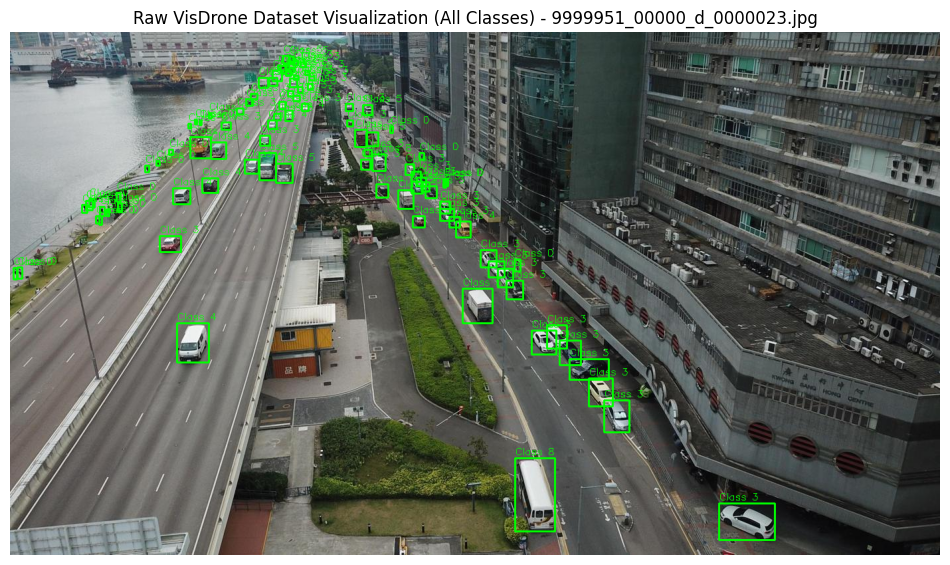
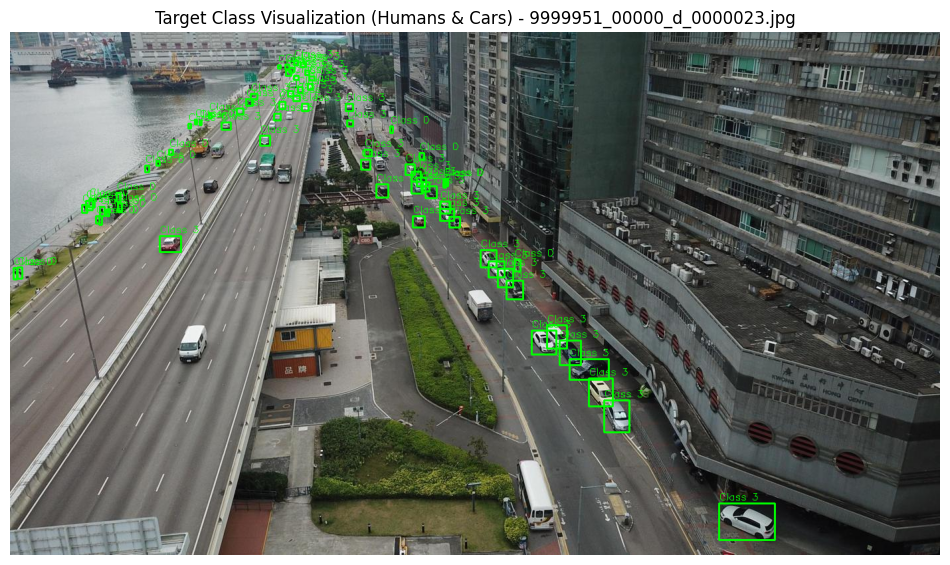
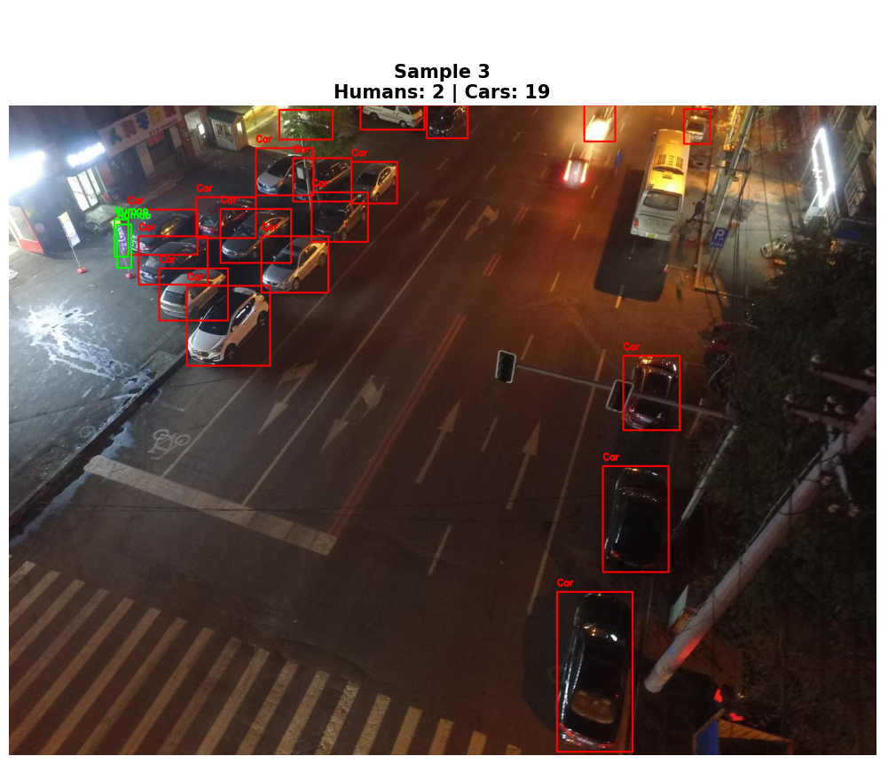
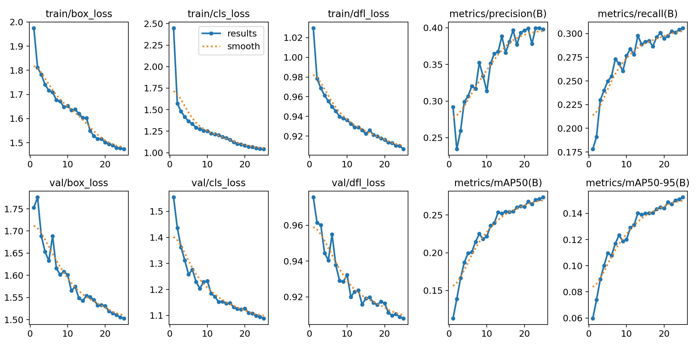

# 🛸 Drone Human Detection & Counting System
### ANTS Antlings Internship Assessment — AI/ML (Intelligence Department)

**Candidate:** MD Ali Hider &nbsp;|&nbsp; **GitHub:** [Ali-Hider](https://github.com/Ali-Hider) &nbsp;|&nbsp; **LinkedIn:** [alihider](https://linkedin.com/in/alihider)

---

## 🎯 Project Overview

An end-to-end computer vision pipeline that detects and counts **humans and cars** in aerial drone imagery using the **VisDrone 2019 dataset**. Built for real-world deployment on ANTS's commercial drone platform.

**Key capabilities:**
- Real-time human & car detection from drone/aerial perspective
- Accurate human count overlay on live output frames
- BoT-SORT object tracking for multi-frame surveillance
- Edge AI optimized — achieves **33.69 FPS** (exceeds 30 FPS real-time threshold)

---

## 📊 Results at a Glance

| Metric | Value |
|---|---|
| Car mAP50 | **0.705** |
| Combined Human mAP50 | 0.245 |
| Inference Speed | **33.69 FPS** ✅ Real-time |
| Tracker | BoT-SORT (bonus) |
| Training Environment | Google Colab T4 GPU |

> **Note on pedestrian mAP:** The lower score is a known characteristic of aerial drone datasets — humans occupy very few pixels at high altitude. The model still reliably identifies human clusters for counting purposes.

---

## 🖼️ Visual Results

### 1. Target Filtering
I implemented a class filter to isolate only the targets of interest (Humans and Cars), reducing noise from other VisDrone classes.


### 2. Human Counting Dashboard
The final output features a real-time dashboard overlaying the total count of unique human targets.


### 3. Object Tracking (Bonus)
Utilizing BoT-SORT, the system maintains unique IDs for each target across frames, enabling flow analysis and avoiding double-counting.


### 4. Model Convergence
The training curves show a consistent decrease in loss and a steady increase in mAP, proving the model converged successfully.


---

## 🎬 Demo Video

▶️ **[Watch the full demo here](YOUR_GOOGLE_DRIVE_LINK)** *(3–5 min walkthrough: dataset → training → detection → tracking)*

---

## 🏗️ Pipeline Architecture

```
VisDrone Dataset
      │
      ▼
 Task 01: Dataset Analysis & Preprocessing
 (class filtering, augmentation, path resolution)
      │
      ▼
 Task 02: YOLOv8 Model Training
 (transfer learning from COCO, fine-tuned on VisDrone)
      │
      ▼
 Task 03: Human & Car Detection + Counting
 (bounding boxes, confidence scores, dashboard overlay)
      │
      ▼
 Task 04: Object Tracking (Bonus)
 (BoT-SORT — unique ID per target across frames)
      │
      ▼
 Task 05: Evaluation & Visualization
 (mAP50, Precision, Recall, FPS, confusion matrix)
```

---

## 🛠️ Tech Stack

| Category | Tools |
|---|---|
| Object Detection | YOLOv8n (Ultralytics) |
| Object Tracking | BoT-SORT |
| Image Processing | OpenCV, Matplotlib |
| Data Management | Pandas, KaggleHub |
| Deep Learning | PyTorch (via Ultralytics) |
| Environment | Google Colab (T4 GPU) |
| Language | Python 3.10+ |

---

## 📁 Repository Structure

```
Drone-Human-Detection-System/
│
├── Drone_Human_Detection_&_Counting_System.ipynb   # Main notebook (all 5 tasks)
├── requirements.txt                                 # Python dependencies
└── README.md                                        # This file
```

> The full pipeline including training outputs, model weights, and result images are stored in Google Drive (linked in the notebook) to keep the repo lightweight.

---

## 🚀 How to Run

### Option 1 — Google Colab (Recommended)

1. Click the **"Open in Colab"** badge at the top of the notebook
2. Go to `Runtime → Change runtime type → T4 GPU`
3. Run all cells top to bottom
4. The notebook will automatically:
   - Download the VisDrone dataset via KaggleHub
   - Fix paths and generate `drone_data.yaml`
   - Train YOLOv8 for 25 epochs
   - Run detection, counting, and tracking

> **Note:** You need a Kaggle API token configured in Colab for the dataset download. Add your `kaggle.json` when prompted.

### Option 2 — Local Setup

```bash
# 1. Clone the repo
git clone https://github.com/Ali-Hider/Drone-Human-Detection-System.git
cd Drone-Human-Detection-System

# 2. Install dependencies
pip install -r requirements.txt

# 3. Open the notebook
jupyter notebook "Drone_Human_Detection_&_Counting_System.ipynb"
```

---

## 🗂️ Dataset

**VisDrone 2019 Detection Dataset**
- Source: [Kaggle — banuprasadb/visdrone-dataset](https://www.kaggle.com/datasets/banuprasadb/visdrone-dataset)
- 10 object classes (pedestrian, people, bicycle, car, van, truck, tricycle, awning-tricycle, bus, motor)
- This system targets: **Class 0** (pedestrian) + **Class 1** (people) = humans, **Class 3** (car)
- Split: Training / Validation / Test sets with YOLO-format `.txt` labels

---

## 🧠 Model & Training Details

| Parameter | Value |
|---|---|
| Architecture | YOLOv8 Nano (`yolov8n.pt`) |
| Base Weights | COCO pretrained (transfer learning) |
| Epochs | 25 |
| Image Size | 640 × 640 px |
| Batch Size | 16 |
| Early Stopping | patience=5 |
| Device | CUDA (T4 GPU) |

**Why YOLOv8 Nano?**
ANTS operates commercial drones that require on-board, edge AI inference. The Nano variant delivers real-time speed (>30 FPS) while remaining deployable on embedded systems — matching ANTS's actual production constraints.

---

## 🔍 Key Engineering Decisions

**1. Dynamic Path Resolver**
The VisDrone Kaggle dataset has a nested directory structure that breaks the default YAML config. I implemented a path-correction script that identifies the absolute path at runtime and regenerates `drone_data.yaml` dynamically — making the pipeline portable across Colab sessions and local machines.

**2. Dual-Class Human Aggregation**
VisDrone labels humans as two separate classes: `pedestrian` (Class 0) for individuals and `people` (Class 1) for groups. The counting logic correctly merges both into a single "TOTAL HUMANS" count, matching real-world surveillance requirements.

**3. Model Persistence to Google Drive**
After training, `best.pt` is saved permanently to Google Drive. This prevents weight loss during Colab session timeouts and simulates production artifact management.

**4. BoT-SORT Tracking**
Extends the detection system from a "frame counter" to a "surveillance tool" — assigning unique IDs per target using Kalman Filter motion tracking + appearance features. Eliminates double-counting across frames.

---

## ⚖️ Strengths & Limitations

### 🌟 Strengths
- **Real-time Edge Optimization:** By utilizing the YOLOv8 Nano architecture, the system achieves an inference speed of **33.69 FPS**. This exceeds the industry-standard 30 FPS threshold, ensuring the model is viable for deployment on resource-constrained onboard drone hardware.
- **Robust Target Persistence:** The implementation of **BoT-SORT tracking** allows the system to maintain unique IDs for targets across frames, eliminating double-counting and enabling the monitoring of specific targets even during temporary occlusions.
- **High-Confidence Vehicle Detection:** The model demonstrates exceptional reliability in car detection (mAP50: 0.705), providing a stable foundation for traffic and vehicle monitoring.

### ⚠️ Limitations
- **Small Object Detection:** Due to the high altitude of the aerial imagery, pedestrians often occupy a very small pixel area. This leads to a higher rate of False Negatives (missed detections) compared to vehicles.
- **Crowd Occlusion:** In densely populated scenes, the model occasionally merges two closely standing people into a single bounding box, a common challenge in top-down aerial perspectives.

### 🛠️ Engineering Challenges Faced
- **Environment & Path Wrangling:** The VisDrone Kaggle dataset had a nested directory structure that conflicted with standard YAML configurations. I solved this by implementing a **dynamic absolute-path resolver**, making the pipeline portable across different server environments.
- **Data Imbalance:** I identified a significant imbalance between the high frequency of vehicles and the fewer human instances. To prevent this from biasing the results, I moved away from global averages and implemented a **Targeted Performance Evaluation**, analyzing the mAP for humans and cars separately.

### 🚀 Future Roadmap
To further enhance the system's performance, particularly for the minority 'human' classes, I propose the following improvements:
1. **SAHI (Slicing Aided Hyper Inference):** Implementing SAHI to slice high-resolution images into smaller tiles, significantly increasing the effective resolution and recall for small pedestrian targets.
2. **Weighted Loss Functions:** Implementing a weighted loss to penalize mistakes on human detections more heavily, forcing the model to prioritize the minority class.
3. **Temporal Smoothing:** Implementing a temporal aggregation layer to smooth human counts across multiple frames, reducing flicker and increasing counting stability.

---

## 👤 About the Candidate

**MD Ali Hider** — BSc CSE, CUET (CGPA 3.18/4.00)

Published researcher in NLP (IEEE ICCIT 2024) with hands-on experience in TensorFlow, Keras, Hugging Face Transformers, and Scikit-learn. Built production-grade SaaS platforms and LLM-powered automation systems.

- 📧 hiderah7@gmail.com
- 🔗 [LinkedIn](https://linkedin.com/in/alihider) | [GitHub](https://github.com/Ali-Hider)

---

*Submitted for ANTS Antlings AI/ML Internship Assessment, May 2026*
